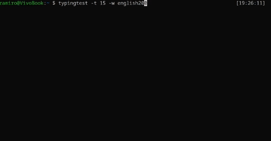

# typeterminal

A simple terminal-based typing test written in Python



## Installation

```bash
pip install typeterminal

```

### Manual Installation

```bash
git clone https://github.com/ramirocabral/typeterminal
cd typeterminal
pip install .
```

## Usage

For usage options, use `typeterminal -h`

```
A simple terminal-based typing test

options:
  -h, --help            Show this help message and exit
  -w, --words {english200,english1000,italian200,italian1000,spanish200,spanish1000}
  -t, --time [10,120]
  -H, --history         Show the history
```

## License

Licensed under [GPL](LICENSE) license
